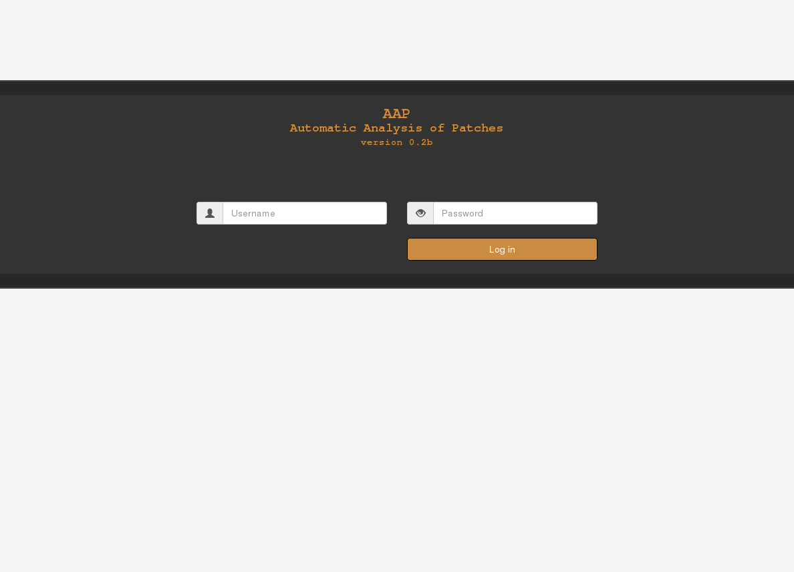
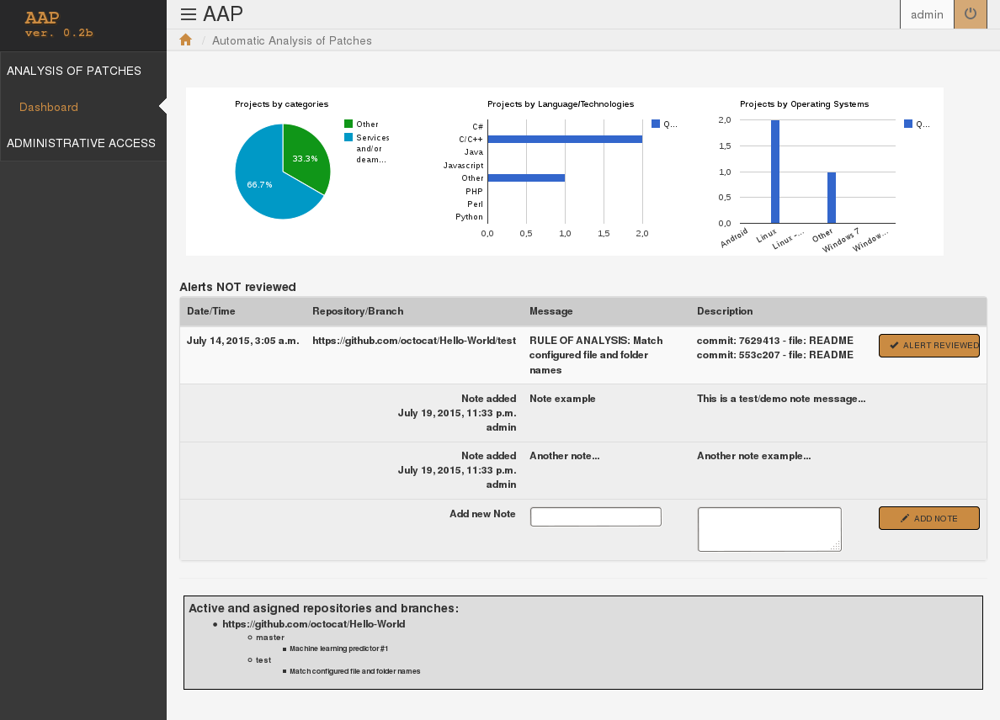
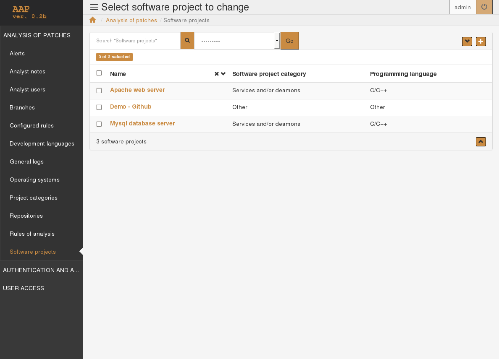
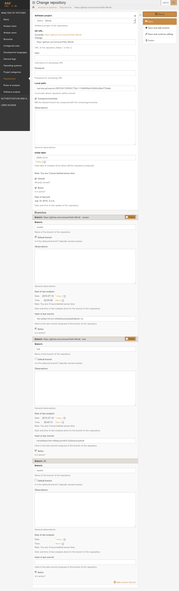
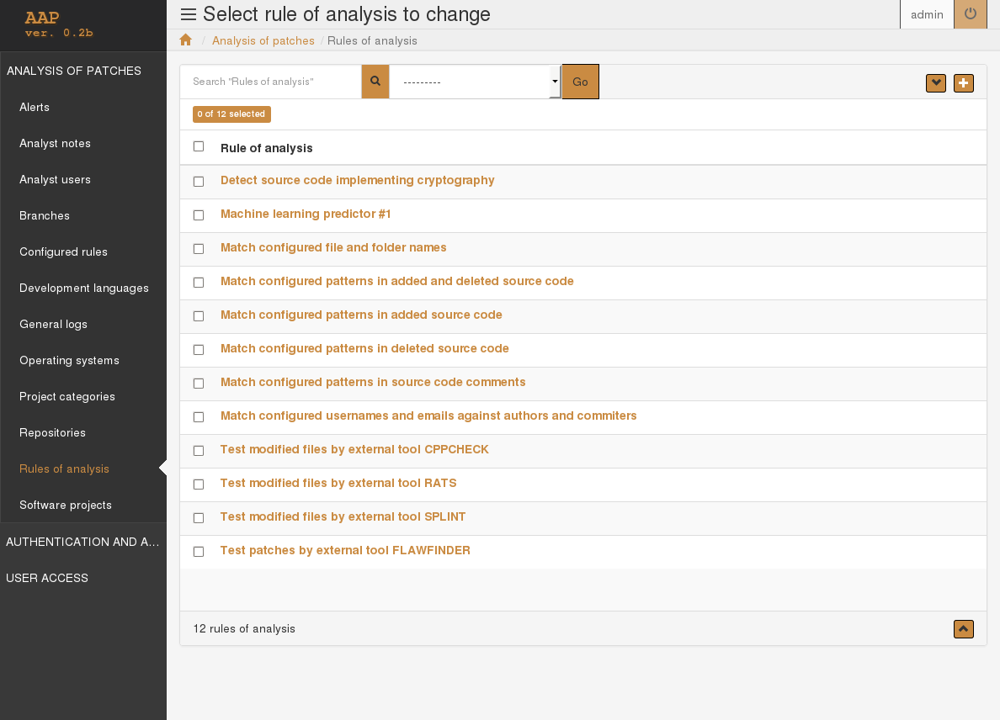
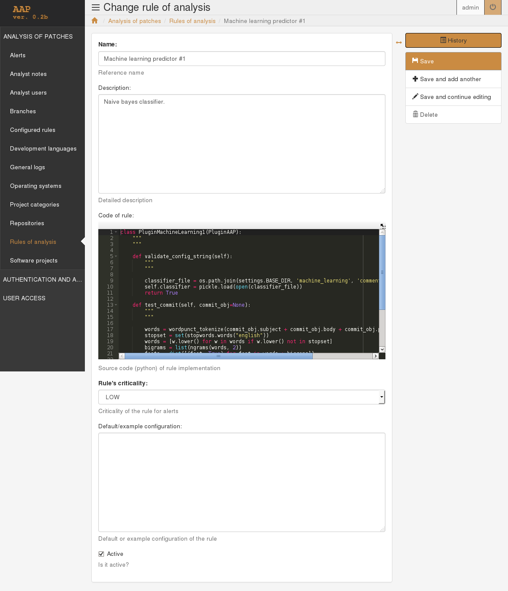

# AAP - beta
## Automatic Analysis of Patches - version 0.2b

Tool for reviewing patches (diffs/commits) and differences between project branches of open or closed source software. It is a Web application developed in Python using the Django Web framework. It depends on Git for managing projects source code to analyze. It also depends on auxiliary Python libraries used in batch or unattended process (cron), in the web interface, and in plugins that implement text-mining/machine-learning  techniques (Natural Language Toolkit, or NLTK, version 3). Other free tools (Flawfinder, cppcheck, SPLINT, RATS, ...) can be used within the automation of analysis or audits also in the form of plugins, along with others implementing checks for updates by specific users, specific patterns in comments or replaced/replacement source code, code that may implement cryptography, etc.

The tool would try to systematize and automate at least the first steps to take in reviewing source code updates to alert, automatically, about possible vulnerabilities, or about code that would need to be especially checked.

## Instalation

More details about installing Web applications of this type are found in the official documentation of django: https://docs.djangoproject.com/en/1.7/. The following are only basic example steps to install and start the application in test or debug mode, using the embedded web server, and using the example configuration.

If not already installed, install git, python (2.7), and virualenv:

	sudo apt-get install git
	sudo apt-get install python
	sudo apt-get install python-virtualenv

Optionally, install source code static analysis tools:

	sudo apt-get install flawfinder
	sudo apt-get install splint
	sudo apt-get install cppcheck
	sudo apt-get install rats

Create directory and clone project from the repository:

	mkdir aap.git
	cd aap.git
	git clone https://github.com/gicsi/aap.git

Create virtual environment for the project:

	cd aap
	virtualenv venv

Activate environment and install django and other python dependencies (including NLTK):

	source venv/bin/activate
	pip install -r requirements.txt

Create configuration file based on the example one, and review default settings (here you can specify another database to use instead of the SQLite file that will be automatically created in the next step; also see for example: https://docs. djangoproject.com/en/dev/ref/settings/#secret-key to set the "secret key"; also check the settings of the unattended process (cron), and at least look at condigurations marked with "xxx" in comments:

	cd src
	cp aap_project/settings.py.example aap_project/settings.py
	vi aap_project/settings.py

* For for fixing the use of english language modify the *LANGUAGES* and *CRON_PROCESS_LANGUAGE_CODE* settings.

Create database (this will create the SQLite file in the root of the source code, and load the sample initial data which includes the github test repository):

	python manage.py migrate

Create initial user; the command will prompt for user name, e-mail and password for the super-user to be created:
	
	python manage.py createsuperuser

Set automatic update and analysis of repositories (via cron):

	python manage.py crontab add

The above command will configure the system crontab (* also, executing *crontab -e* to add *PYTHONIOENCODING=utf8* before the new line added may be needed), returning an identifier or hash; this can be used to start the process manually:

	python manage.py crontab run <identifier/hash>

## Starting the Web interface

Start the embedded django development server (by default it will be available in http://127.0.0.1:8000/):

	source venv/bin/activate # if not already activated
	cd src
	python manage.py runserver

Alternatively, to use another port, for example the 4444 -and listen on all interfaces-, the last line could be replaced by:

	python manage.py runserver 0.0.0.0:4444

## System directory structure

The documentation directory, *doc*, at the moment, only contains articles and slides with which the project was presented.
Except for the documentation, license, and files relative to the virtual environment, the application is contained in the directory *src*.
There, as much as possible, the structure of files and directories was organized in accordance with the recommendations of the django documentation.
The application consists basically of a peel project (where the general system configuration is included, *settings.py file*) in the directory *app_project*, and an application, *app_aap*, where data models were defined, the Web interface customized, and where the code of the batch process to be executed via cron was placed.
Modified templates and static content were located in directories *templates* and *static* respectively.
The files relating to internationalization are in the directory *locale*; at the moment, supported languages ​​are spanish and english.
The directory where the repositories are going to be cloned, *REPOSITORIES*, is located also in *src*, but of course can be relocated by changing the settings.
In the directory *crypto_dict* are located the dictionary for reviewing patterns of code that may implement cryptography, along with the script for generating it.
The directory *machine_learning* contains data, classifiers and scripts related to the use of of these techniques with NLTK in the application.

	aap
	├── doc
	│   ├── cacic_07-2015
	│   │   └── paper
	│   │       └── aap_draft_es.doc
	│   ├── rootedcon_02-2015
	│   │   ├── paper
	│   │   │   ├── aap.pdf
	│   │   │   └── aap.tex
	│   │   └── slides
	│   │       ├── aap.pdf
	│   │       └── aap.tex
	│   └── screenshots
	│   	├── cap0_en.png
	│   	├── cap0_es.png
	│   	├── cap1_en.png
	│   	├── cap1_es.png
	│       └── ...
	├── LICENSE.txt
	├── README.en.md
	├── README.es.md
	├── README.md
	├── requirements.txt
	├── src
	│   ├── aap_app
	│   │   ├── admin.py
	│   │   ├── apps.py
	│   │   ├── cron.py
	│   │   ├── fixtures
	│   │   │   ├── initial_data.xml
	│   │   │   └── make.txt
	│   │   ├── __init__.py
	│   │   ├── models.py
	│   │   ├── tests.py
	│   │   ├── urls.py
	│   │   └── views.py
	│   ├── aap_project
	│   │   ├── __init__.py
	│   │   ├── settings.py
	│   │   ├── settings.py.example
	│   │   ├── urls.py
	│   │   └── wsgi.py
	│   ├── crypto_dict
	│   │   ├── dict.txt
	│   │   └── make.py
	│   ├── db.sqlite3
	│   ├── locale
	│   │   ├── en
	│   │   │   └── LC_MESSAGES
	│   │   │       ├── django.mo
	│   │   │       └── django.po
	│   │   ├── es
	│   │   │   └── LC_MESSAGES
	│   │   │       ├── django.mo
	│   │   │       └── django.po
	│   │   └── make.txt
	│   ├── machine_learning
	│   │   ├── comments_DecisionTree.out
	│   │   ├── comments_DecisionTree.pickle
	│   │   ├── comments_NaiveBayes.out
	│   │   ├── comments_NaiveBayes.pickle
	│   │   ├── data
	│   │   │   ├── comments
	│   │   │   │   ├── bug
	│   │   │   │   │   ├── ob_1
	│   │   │   │   │   ├── ...
	│   │   │   │   │   ├── rh_1
	│   │   │   │   │   └── ...
	│   │   │   │   └── vuln
	│   │   │   │       ├── ob_1
	│   │   │   │       ├── ...
	│   │   │   │       ├── rh_1
	│   │   │   │       └── ...
	│   │   │   └── patches
	│   │   │       ├── bug
	│   │   │       │   ├── ob_102
	│   │   │       │   ├── ...
	│   │   │       │   ├── rh_113
	│   │   │       │   └── ...
	│   │   │       └── vuln
	│   │   │           ├── ob_1
	│   │   │           ├── ...
	│   │   │           ├── rh_48
	│   │   │           └── ...
	│   │   ├── dl_openbsd_errata.py
	│   │   ├── dl_redhat_bugzilla.py
	│   │   ├── make_classifiers.sh
	│   │   ├── nltk-trainer-master
	│   │   │   └── ...
	│   │   ├── patches_DecisionTree.out
	│   │   ├── patches_DecisionTree.pickle
	│   │   ├── patches_NaiveBayes.out
	│   │   ├── patches_NaiveBayes.pickle
	│   │   ├── test_classifiers.out
	│   │   └── test_classifiers.py
	│   ├── manage.py
	│   ├── REPOSITORIES
	│   │   └── ....
	│   ├── static
	│   │   └── admin
	│   │       └── css
	│   │           └── base.css
	│   └── templates
	│       ├── aap
	│       │   ├── dashboard.html
	│       │   ├── index.html
	│       │   └── login.html
	│       ├── admin
	│       │   ├── app_index.html
	│       │   ├── base.html
	│       │   ├── base_site.html
	│       │   ├── index.html
	│       │   └── login.html
	│       ├── bootstrap_admin
	│       │   └── sidebar_menu.html
	│       └── VERSION.txt -> ../../VERSION.txt
	├── venv
	│   └── ...
	└── VERSION.txt

## Screenshots

Below are some screenshots of different application modules of the Web interface.

### Login page

Access control. Users can be defined as analysts or administrators.

### Initial page or dashboard

The initial page shows summarized information about loaded projects, displays not yet reviewed alerts and permits the handling of alerts notes.

### Software projects

Listing of projects to be audited loaded in the application.

### Repository data edition

Detail or edition page of a repository of a software project (including branches).

### Rules of analysis

Listing of rules of analysis, or plugins, loaded in the application.

### Edition of rule of analysis

Edition page of a rule of analysis or plugin.

## Authors

Grupo de Investigación en Criptografía y Seguridad Informática (GICSI). Laboratorio de Criptología y Seguridad Teleinformática, Escuela Superior Técnica (EST) - Instituto Universitario del Ejército (IUE). Argentina.

Antonio Castro Lechtaler, Marcelo Cipriano, Edith García, Julio César Liporace, Ariel Maiorano, Eduardo Malvacio, Néstor Tapia.

## Contributors

## Acknowledgements

## License

AAP - Análisis Automático de Parches
Copyright (C) GICSI 2015

This program is free software: you can redistribute it and/or modify
it under the terms of the GNU General Public License as published by
the Free Software Foundation, either version 3 of the License, or
(at your option) any later version.

This program is distributed in the hope that it will be useful,
but WITHOUT ANY WARRANTY; without even the implied warranty of
MERCHANTABILITY or FITNESS FOR A PARTICULAR PURPOSE.  See the
GNU General Public License for more details.

You should have received a copy of the GNU General Public License
along with this program.  If not, see <http://www.gnu.org/licenses/>.

