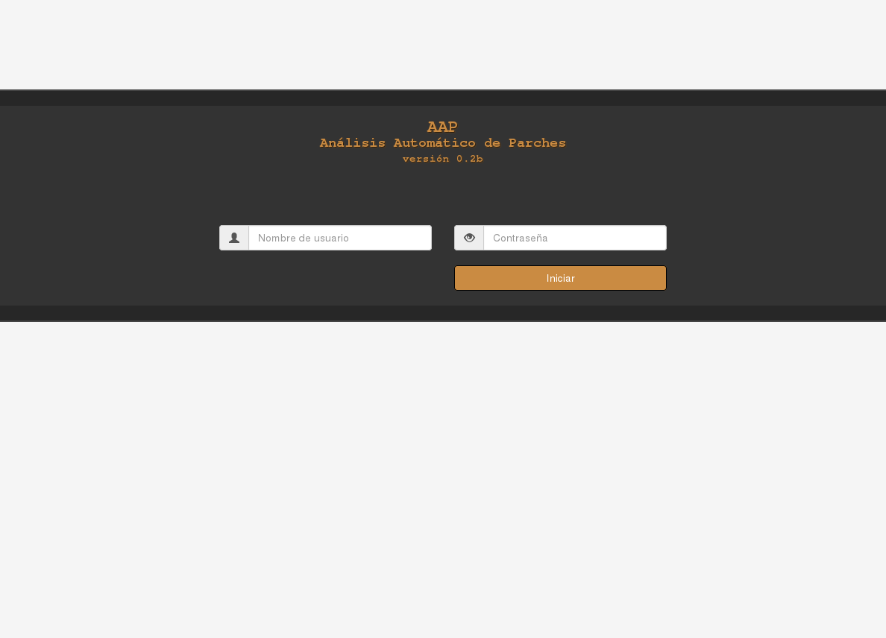
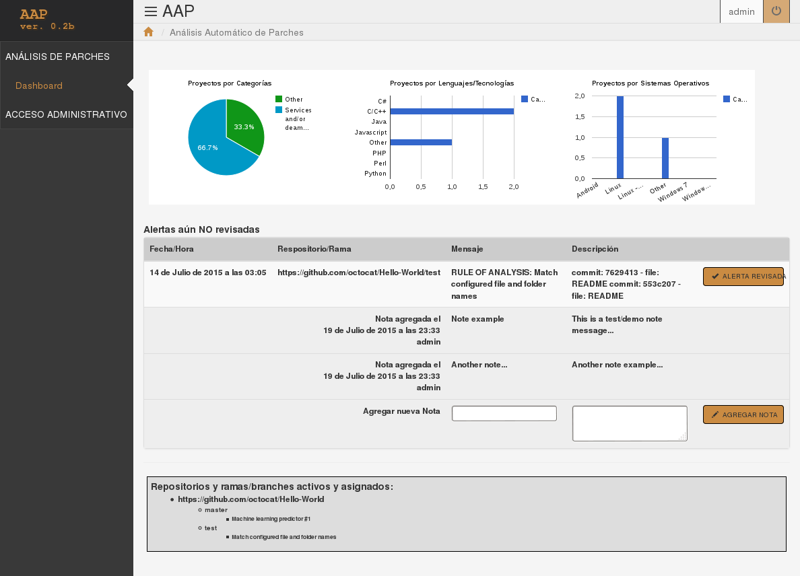
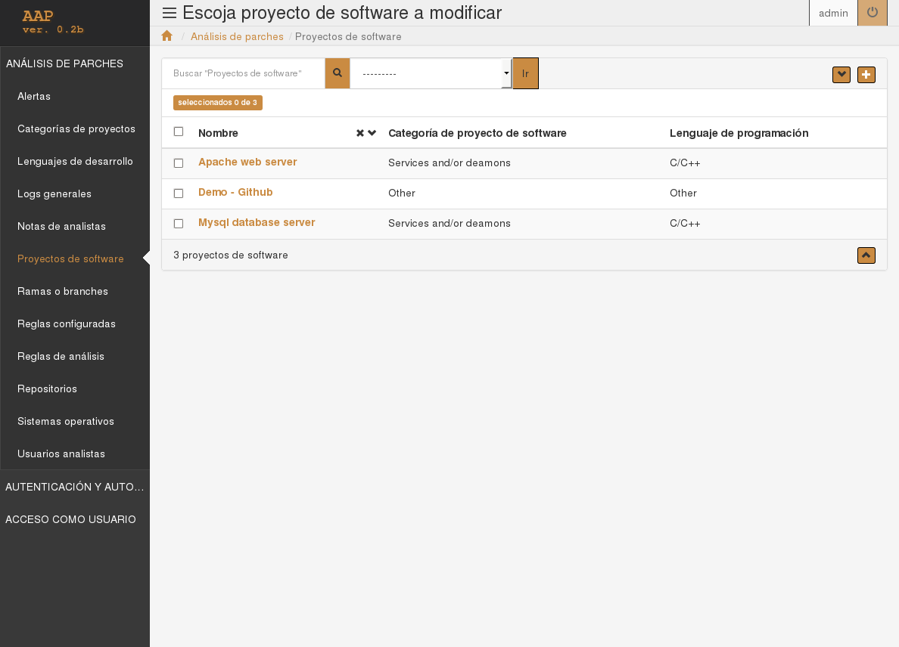
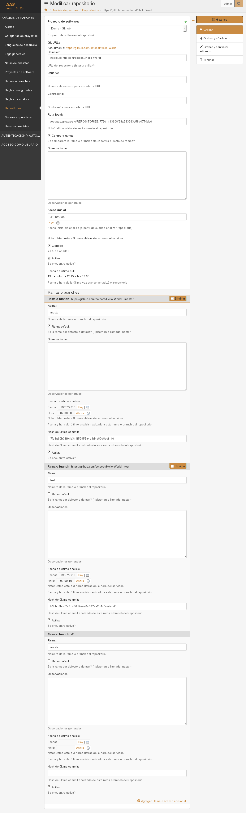
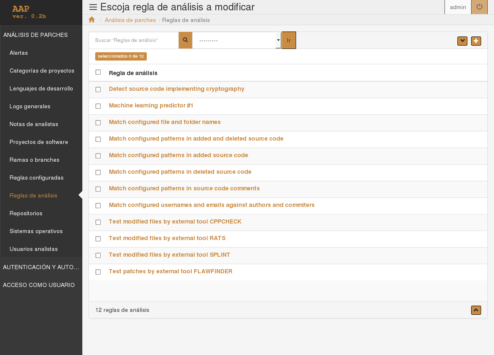
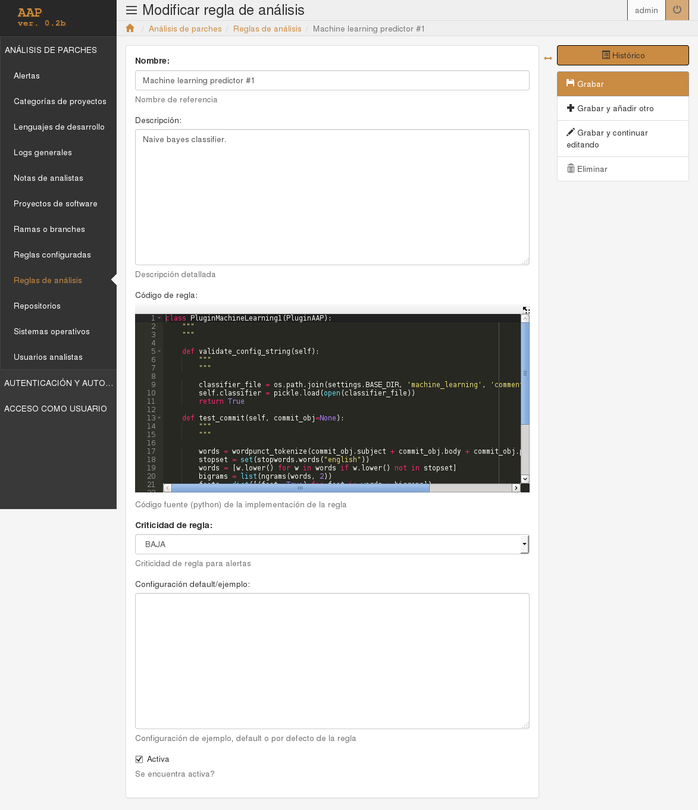

# AAP - beta
## Análisis Automático de Parches - versión 0.2b

Herramienta para la revisión de parches *(patches/diffs/commits)* y diferencias entre ramas o *branches* de proyectos de software de código abierto o cerrado. Se trata de una aplicación Web, desarrollada en lenguaje Python, utilizando el framework Web Django. Depende de Git para el manejo del código fuente de los proyectos a analizar. Depende también de librerías Pyhton auxiliares utilizadas en el proceso batch o desatendido (cron), en la interfaz web, y en plugins que implementen técnicas de text-mining/machine-learning (Natural Language Toolkit, o NLTK, versión 3). Otras herramientas libres (FlawFinder, cppcheck, SPLINT, RATS, ...) pueden ser utilizadas dentro de la automatización de análisis o auditorías también en la forma de plugins, junto a aquellos implementados para buscar actualizaciones por parte de usuarios específicos, conteniendo patrones específicos en comentarios o en código fuente reemplazado/reemplazante, código que implementaría criptografía, etc.

La herramienta intentaría sistematizar y automatizar al menos los primeros pasos a tomar en la revisión de actualizaciones de código fuente para alertar, automáticamente, acerca de posibles vulnerabilidades, o acerca de código que se necesitaría revisar especialmente.

## Instalación

Más detalles acerca de cómo instalar aplicaciones Web de este tipo se encuentran en la documentación oficial de django: https://docs.djangoproject.com/en/1.7/. A continuación se detallan, básicamente y sólo a manera de ejemplo, los pasos a seguir para instalar y arrancar la aplicación en modo de prueba o debug, utilizando el servidor web embebido, y utilizando la configuración de ejemplo.

Si no estuvieran ya instalados, instalar git, python (2.7), y virualenv:

	sudo apt-get install git
	sudo apt-get install python
	sudo apt-get install python-virtualenv

Opcionalmente, instalar herramientas de análisis estático de código fuente:

	sudo apt-get install flawfinder
	sudo apt-get install splint
	sudo apt-get install cppcheck
	sudo apt-get install rats

Crear directorio y clonar proyecto desde el repositorio:

	mkdir aap.git
	cd aap.git
	git clone https://github.com/gicsi/aap.git

Crear entorno virtual para el proyecto:

	cd aap
	virtualenv venv

Activar entorno e instalar django y demás dependencias python (incluyendo NLTK):

	source venv/bin/activate
	pip install -r requirements.txt

Crear archivo de configuración en base a ejemplo, y revisar configuraciones por defecto (aquí puede especificarse el uso de otra base de datos en lugar del archivo SQLite que se crearía automáticamente en el paso siguiente; ver también por ejemplo: https://docs.djangoproject.com/en/dev/ref/settings/#secret-key para configurar la "llave secreta"; revisar también las configuraciones relativas al proceso desatendido (cron), y al menos lo marcado con "xxx" en comentarios:

	cd src
	cp aap_project/settings.py.example aap_project/settings.py
	vi aap_project/settings.py

* Para fijar el uso del idioma español, se deberían ajustar las condifguraciones *LANGUAGES*, *CRON_PROCESS_LANGUAGE_CODE*.

Crear base de datos (esto creará el archivo SQLite en la raíz del código fuente, y cargará los datos inciales de ejemplo -que incluyen al repositorio github de prueba-):

	python manage.py migrate

Cargar usuario inicial; el comando preguntará nombre de usuario, e-mail y contraseña para el super-usuario a crear:
	
	python manage.py createsuperuser

Establecer ejecución automática de actualización de repositorios y análisis (vía cron):

	python manage.py crontab add

El comando anterior configurará el crontab del sistema (* además, puede ser necesario ejecutar *crontab -e* para agregar *PYTHONIOENCODING=utf8* antes de la línea agregada), devolviendo un identificador o hash; éste puede usarse para arrancar el proceso manualmente:

	python manage.py crontab run <identificador/hash>

## Arranque de la interfaz Web

Arrancar servidor de desarrollo embebido django (por defecto quedará disponible en http://127.0.0.1:8000/):

	source venv/bin/activate # si no estuviese ya activado
	cd src
	python manage.py runserver

Alternativamente, para usar otro puerto -por ejemplo el 4444- y escuchar en todas las interfaces podría reemplazarse la última línea por:

	python manage.py runserver 0.0.0.0:4444

## Estructura de directorios del sistema

El directorio de documentación, *doc*, de momento, contiene únicamente los artículos y diapositivas con los que se presentó el proyecto.
Salvo por la documentación, archivos de licencia, y lo relativo al entorno virtual, la aplicación se encuentra contenida en el directorio *src*.
Allí, tanto como fue posible, la estructura de archivos y directorios se organizó de acuerdo a lo recomendado por la documentación de django.
La aplicación consta básicamente de un proyecto cáscara (donde está incluida la configuración general del sistema, archivo *settings.py*), en el directorio *app_project*, y de una aplicación, en *aap_app*, donde se definieron los modelos de datos, se particularizó la interfaz Web, y se codificó el proceso batch o desatendido a ser ejecutado vía cron.
Las plantillas y contenido estático modificados se ubicaron en los directorios *templates* y *static* respectivamente.
Los archivos relativos a la internacionalización se encuentras en el directorio *locale*; de momento los idiomas soportados son español e inglés.
El directorio en donde se ubicarán los repositorios a clonar, *REPOSITORIES*, se encuetra también dentro de *src* pero por supuesto puede reubicarse modificando la configuración.
En el directorio de *crypto_dict* se encuentra el diccionario de patrones para la revisión de código que implementaría criptografía, junto con el script para generalo.
En el directorio *machine_learning* se encuentran los datos, clasificadores y scripts relativos a la utilización de estas técnicas mediante NLTK en la aplicación.

	aap
	├── doc
	│   ├── cacic_07-2015
	│   │   └── paper
	│   │       └── aap_draft_es.doc
	│   ├── rootedcon_02-2015
	│   │   ├── paper
	│   │   │   ├── aap.pdf
	│   │   │   └── aap.tex
	│   │   └── slides
	│   │       ├── aap.pdf
	│   │       └── aap.tex
	│   └── screenshots
	│   └── screenshots
	│   	├── cap0_en.png
	│   	├── cap0_es.png
	│   	├── cap1_en.png
	│   	├── cap1_es.png
	│       └── ...
	├── LICENSE.txt
	├── README.en.md
	├── README.es.md
	├── README.md
	├── requirements.txt
	├── src
	│   ├── aap_app
	│   │   ├── admin.py
	│   │   ├── apps.py
	│   │   ├── cron.py
	│   │   ├── fixtures
	│   │   │   ├── initial_data.xml
	│   │   │   └── make.txt
	│   │   ├── __init__.py
	│   │   ├── models.py
	│   │   ├── tests.py
	│   │   ├── urls.py
	│   │   └── views.py
	│   ├── aap_project
	│   │   ├── __init__.py
	│   │   ├── settings.py
	│   │   ├── settings.py.example
	│   │   ├── urls.py
	│   │   └── wsgi.py
	│   ├── crypto_dict
	│   │   ├── dict.txt
	│   │   └── make.py
	│   ├── db.sqlite3
	│   ├── locale
	│   │   ├── en
	│   │   │   └── LC_MESSAGES
	│   │   │       ├── django.mo
	│   │   │       └── django.po
	│   │   ├── es
	│   │   │   └── LC_MESSAGES
	│   │   │       ├── django.mo
	│   │   │       └── django.po
	│   │   └── make.txt
	│   ├── machine_learning
	│   │   ├── comments_DecisionTree.out
	│   │   ├── comments_DecisionTree.pickle
	│   │   ├── comments_NaiveBayes.out
	│   │   ├── comments_NaiveBayes.pickle
	│   │   ├── data
	│   │   │   ├── comments
	│   │   │   │   ├── bug
	│   │   │   │   │   ├── ob_1
	│   │   │   │   │   ├── ...
	│   │   │   │   │   ├── rh_1
	│   │   │   │   │   └── ...
	│   │   │   │   └── vuln
	│   │   │   │       ├── ob_1
	│   │   │   │       ├── ...
	│   │   │   │       ├── rh_1
	│   │   │   │       └── ...
	│   │   │   └── patches
	│   │   │       ├── bug
	│   │   │       │   ├── ob_102
	│   │   │       │   ├── ...
	│   │   │       │   ├── rh_113
	│   │   │       │   └── ...
	│   │   │       └── vuln
	│   │   │           ├── ob_1
	│   │   │           ├── ...
	│   │   │           ├── rh_48
	│   │   │           └── ...
	│   │   ├── dl_openbsd_errata.py
	│   │   ├── dl_redhat_bugzilla.py
	│   │   ├── make_classifiers.sh
	│   │   ├── nltk-trainer-master
	│   │   │   └── ...
	│   │   ├── patches_DecisionTree.out
	│   │   ├── patches_DecisionTree.pickle
	│   │   ├── patches_NaiveBayes.out
	│   │   ├── patches_NaiveBayes.pickle
	│   │   ├── test_classifiers.out
	│   │   └── test_classifiers.py
	│   ├── manage.py
	│   ├── REPOSITORIES
	│   │   └── ....
	│   ├── static
	│   │   └── admin
	│   │       └── css
	│   │           └── base.css
	│   └── templates
	│       ├── aap
	│       │   ├── dashboard.html
	│       │   ├── index.html
	│       │   └── login.html
	│       ├── admin
	│       │   ├── app_index.html
	│       │   ├── base.html
	│       │   ├── base_site.html
	│       │   ├── index.html
	│       │   └── login.html
	│       ├── bootstrap_admin
	│       │   └── sidebar_menu.html
	│       └── VERSION.txt -> ../../VERSION.txt
	├── venv
	│   └── ...
	└── VERSION.txt

## Capturas de pantalla

A continuación algunas capturas de pantalla o *screenshots* de diferentes módulos de la interfaz Web de la aplicación.

### Página de control de ingreso

Control de acceso. Los usuarios pueden estar definidos como analistas o administradores.

### Página inicial o *dashboard*

La página inicial muestra información sumarizada acerca de los proyectos cargados, permite la visualización de alertas aún no revisadas y el manejo de notas sobre las alertas.

### Proyectos de software

Listado de proyectos a auditar cargados en la aplicación.

### Edición de datos de repositorio

Página de detalles o de edición de información de un repositorio de un proyecto de software (incluyendo sus ramas o *branches*).

### Reglas de análisis

Listado de reglas de análisis, o plugins, cargadas en la aplicación.

### Edición de regla de análisis

Página de edición de una regla de análisis o plugin.

## Autores

Grupo de Investigación en Criptografía y Seguridad Informática (GICSI). Laboratorio de Criptología y Seguridad Teleinformática, Escuela Superior Técnica (EST) - Instituto Universitario del Ejército (IUE). Argentina.

Antonio Castro Lechtaler, Marcelo Cipriano, Edith García, Julio César Liporace, Ariel Maiorano, Eduardo Malvacio, Néstor Tapia.

## Contribuyentes

## Agradecimientos

## Licencia

AAP - Análisis Automático de Parches
Copyright (C) GICSI 2015

This program is free software: you can redistribute it and/or modify
it under the terms of the GNU General Public License as published by
the Free Software Foundation, either version 3 of the License, or
(at your option) any later version.

This program is distributed in the hope that it will be useful,
but WITHOUT ANY WARRANTY; without even the implied warranty of
MERCHANTABILITY or FITNESS FOR A PARTICULAR PURPOSE.  See the
GNU General Public License for more details.

You should have received a copy of the GNU General Public License
along with this program.  If not, see <http://www.gnu.org/licenses/>.

